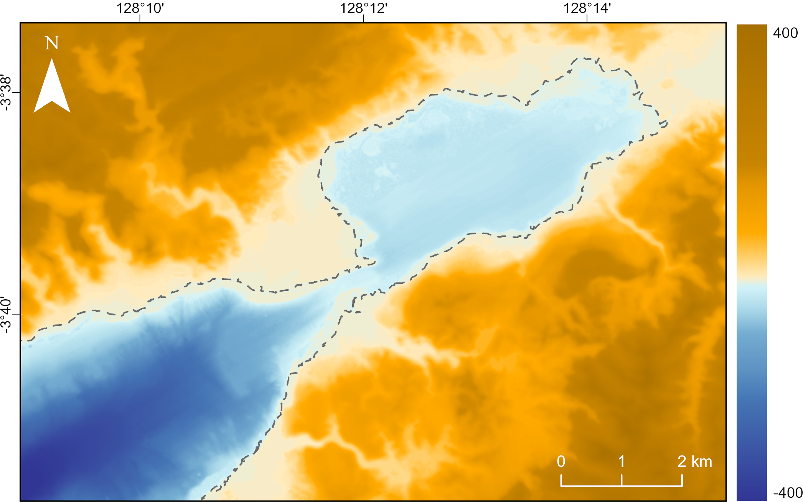

# Ambon Bay (Indonesia) Coastal Datasets

## Overview
This repository contains the datasets and supporting materials associated with the study:
<b>"Continuous coastal topography and building exposure data for tsunami risk assessment in Ambon Bay, Indonesia"</b>.
The dataset provides high-resolution spatial information describing the coastal topography and building exposure characteristics of Ambon Bay, Indonesia. It was developed to support seismic- and landslide-tsunami modelling, exposure assessment, and risk analysis applications in the Banda Sea region.
The datasets can be applied to a range of coastal hazard and risk studies, including but not limited to:
- Numerical tsunami simulations
- Flood and sea level rise modelling
- Coastal hazard mapping
- Exposure analysis
- Risk modelling
- Geospatial analysis

This dataset is associated with a manuscript currently under peer-review. Until publication, please cite this repository as:

> Syamsidik, Constance Ting Chua, Teuku Andri Renaldi, Anawat Suppasri, Yuto Mukaida, Muhammad Zawil Kiram, Haddad Rahmat, Shahibul Mighvar, Muhammad Daffa Al Farizi and Ferad Puturuhu (2026). Continuous coastal topography and building exposure data for tsunami risk assessment in Ambon Bay, Indonesia. 
> https://github.com/tsunami-engineer/ambon_coastaldata

Please update the citation to the final published article once the manuscript becomes available.

## Data description
This repository provides two complementary geospatial datasets developed for Ambon Bay, Indonesia, to support coastal hazard and risk assessment applications.

The first dataset is a detailed **building exposure database** developed from field surveys in Ambon Bay, Indonesia. It provides digitised building footprints together with construction, occupancy, and other attributes relevant for exposure and vulnerability assessments.
The second dataset is a high-resolution (10 m) **continuous coastal topo-bathymetric Digital Elevation Model (DEM)** developed by integrating multibeam echosounder (MBES) measurements and satellite-derived bathymetry (SDB). The dataset provides a consistent representation of both terrestrial and marine elevation across Ambon Bay, supporting improved simulation of coastal processes, including tsunami propagation and inundation from regional seismic sources and potential local submarine landslide sources.

---

## Data contents
The repository contains the following datasets:

### 1. Building exposure datasets

**File format:** ESRI Shapefile (`.zip`) and `.xlsx`
**File name:** `Ambon_Building_Characteristics.zip`

The ZIP file contains the complete ESRI Shapefile dataset, including the required components:

- `.shp` — building geometry
- `.shx` — shape index
- `.dbf` — attribute table
- `.prj` — coordinate reference system information

**Coordinate reference system:**
- WGS 1984 geographic coordinate system
- Units: decimal degrees

The shapefile can be imported and analysed using Geographic Information System (GIS) software such as ArcGIS or QGIS.

**Building dataset variables:**
| Label | Variable | Details |
|---|---|---|
| ID | Building ID | Building unique identification number |
| Lon | Longitude | Longitude of building structure centroid (decimal degrees) |
| Lat | Latitude | Latitude of building structure centroid (decimal degrees) |
| NumFloor | Number of story(s) | Number of stories |
| Area | Building Area | Area of building footprint (m²) |
| Class | HAZUS classification | Modified HAZUS building classification |
| Function | Building function | Occupancy function, i.e., Residential, Commercial, Culture and religion, Health facility, School and University |
| SubDist | Sub-district | Sub-district in Ambon |
| Elevation | Elevation above sea level | Elevation of building location above mean sea level (m) |
| Distance | Distance to shoreline | Distance of building location to shoreline (m) |
| Slope | Building slope | Slope gradient of ground around building (°) |

  

  <em>Classification of buildings in Ambon Bay, Indonesia using modified HAZUS taxonomy.</em>

### 2. Continuous Coastal Topo-bathymetric Digital Elevation Model (DEM)

**File format:** GeoTIFF raster (`.tif`)  
**File name:** `Ambon_CoastalDEM_10m.tif`

**Dataset characteristics:**

- Horizontal resolution: 10 m
- Vertical unit: metres
- Coordinate reference system:
  - WGS 1984 / UTM Zone 52S
  - EPSG: 32752
- Data type: elevation relative to mean sea level

The DEM is provided as a GeoTIFF raster and can be directly used in Geographic Information System (GIS) software and numerical models requiring raster elevation input.

  

  <em>Continuous topo-bathymetric DEM (in meters) of Ambon Bay, Indonesian and the median shoreline.</em>

---
## License

[CC BY 4.0](https://creativecommons.org/licenses/by/4.0/)

## Acknowledgements
This dataset was developed as part of a collaborative research project between the International Research Institute of Disaster Science (IRIDeS) Tohoku University, Tsunami and Disaster Mitigation Research Center (TDMRC), Universitas Syiah Kuala and Universitas Pattimura. This activity is part of the JST-JICA SATREPS (Science and Technology Research Partnership for Sustainable Development) project, Building a Sustainable System for Resilience and Innovation in the Coastal Community (BRICC). 

## Disclaimer

The datasets represent a spatial database developed for regional-scale coastal hazard applications. Users should consider the following:
- The DEM resolution is 10 m and may not represent very small-scale coastal features.
- Building characteristics represent the survey and digitisation period of the dataset development.
- Users applying the dataset for detailed engineering design should validate the data against updated local observations.

The authors are not responsible for any decisions or outcomes resulting from the use of this dataset.
